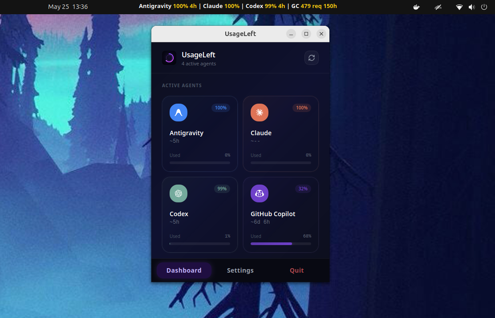

# UsageLeft

> **Note**: We are a fork of OpenUsage but not affiliated, endorsed, or backed by OpenUsage.

UsageLeft is an Ubuntu-only app. It tracks AI coding subscription usage from the Ubuntu status indicator.

UsageLeft runs as a desktop app, stays available from Ubuntu Status Menus / AppIndicators, and gives quick access to agent sessions, usage, reset times, refresh actions, settings, and the full dashboard.



## Quick Start

Install from a release:

```bash
sudo apt install -y ./UsageLeft_*_amd64.deb
```

Build and install from source:

```bash
make setup
make package
sudo apt install -y ./dist/linux/*.deb
```

Run from source during development:

```bash
make dev
```

Need the full build guide? See [docs/linux-build.md](docs/linux-build.md).

## What It Does

UsageLeft tracks usage from AI coding tools and shows it in two places:

- **Ubuntu status indicator menu.** Quick session tracker with enabled signed-in agents, usage left or used, reset timing, refresh all, settings, and quit.
- **Glass dashboard window.** Pictorial tray-style view with up to six agent cards, provider logos, session/token status, per-agent refresh, settings, about, and quit.

Main features:

- Tracks multiple AI agent sessions in one place.
- Enables Claude, Codex, Cursor, Gemini, and GitHub Copilot by default.
- Shows progress, badges, reset timers, and provider-specific usage lines.
- Refreshes automatically on a configurable interval.
- Supports manual refresh for all enabled providers.
- Supports a global keyboard shortcut to show or hide the dashboard.
- Starts on login when enabled in settings.
- Exposes a local HTTP API on `127.0.0.1:6736`.
- Supports SOCKS5 and HTTP proxies for provider requests.
- Builds clean Ubuntu binaries, `.deb` packages, and AppImages.

## Ubuntu Status Indicator

UsageLeft creates an Ubuntu indicator entry. The indicator menu is the fastest way to monitor usage without opening the full dashboard.

The menu includes:

- **Show Dashboard** opens the main window.
- **Refresh All** refreshes enabled providers.
- **Agent rows** show signed-in providers only.
- **Settings** opens app configuration.
- **Quit** exits the app.

Agent rows show the most useful short status available:

- Percent, request count, token count, or dollar amount left.
- Reset timing when a provider exposes it.
- Hidden state for providers that are not signed in or have no usable session data.

The status indicator uses a compact all-agent strip by default. It renders as a white monochrome icon for Ubuntu's dark top bar and sets the tray title to a short status string like `Codex 72% 2h left  |  Claude 35 req left`.

The rich glassmorphism dashboard is opened from the indicator. Ubuntu AppIndicator menus only support native menu rows, so the native indicator menu stays simple while the dashboard provides the visual card layout.

GNOME may need AppIndicator support enabled depending on the Ubuntu image. Install the Ayatana AppIndicator package:

```bash
sudo apt install -y libayatana-appindicator3-dev
```

## Supported Providers

- [**Amp**](docs/providers/amp.md) / free tier, bonus, credits
- [**Antigravity**](docs/providers/antigravity.md) / all models
- [**Claude**](docs/providers/claude.md) / session, weekly, extra usage, local token usage through ccusage
- [**Codex**](docs/providers/codex.md) / session, weekly, reviews, credits
- [**GitHub Copilot**](docs/providers/copilot.md) / premium, chat, completions
- [**Cursor**](docs/providers/cursor.md) / credits, total usage, auto usage, API usage, on-demand, CLI auth
- [**Factory / Droid**](docs/providers/factory.md) / standard, premium tokens
- [**Gemini**](docs/providers/gemini.md) / pro, flash, workspace/free/paid tier
- [**Grok**](docs/providers/grok.md) / credits used, plan, pay-as-you-go cap
- [**JetBrains AI Assistant**](docs/providers/jetbrains-ai-assistant.md) / quota, remaining
- [**Kiro**](docs/providers/kiro.md) / credits, bonus credits, overages
- [**Kimi Code**](docs/providers/kimi.md) / session, weekly
- [**MiniMax**](docs/providers/minimax.md) / coding plan session
- [**OpenCode Go**](docs/providers/opencode-go.md) / 5h, weekly, monthly spend limits
- [**Perplexity**](docs/providers/perplexity.md) / usage and subscription state
- [**Windsurf**](docs/providers/windsurf.md) / prompt credits, flex credits
- [**Z.ai**](docs/providers/zai.md) / session, weekly, web searches

## Requesting New Agents

Want to track usage for another provider? We welcome community contributions!
If you want to add support for your preferred agent, you can:
- **Open an Issue**: Create an issue requesting support for the agent.
- **Submit a Pull Request**: Add support yourself by creating a plugin. See the [Plugin API](docs/plugins/api.md) for how to build and integrate a new provider.

## Install From Release

Download the latest Ubuntu `.deb` or AppImage from:

<https://github.com/anush-labs/UsageLeft/releases/latest>

Install the `.deb`:

```bash
sudo apt install -y ./UsageLeft_*_amd64.deb
```

Run the AppImage:

```bash
chmod +x ./UsageLeft_*_amd64.AppImage
./UsageLeft_*_amd64.AppImage
```

Official release builds support app updates.

## Build From Source

UsageLeft uses:

- Ubuntu / Linux desktop
- Tauri v2
- Rust stable
- Node.js + npm
- React + Vite

Install everything needed for Ubuntu builds:

```bash
make setup
```

If Rust was just installed and `cargo` is not found:

```bash
source "$HOME/.cargo/env"
```

Run checks:

```bash
make check
make cargo-check
```

Build a raw Ubuntu binary:

```bash
make binary
```

Output:

```text
dist/linux/usageleft
```

Build local Ubuntu packages:

```bash
make package
```

Output:

```text
dist/linux/usageleft
dist/linux/UsageLeft_<version>_amd64.deb
dist/linux/UsageLeft_<version>_amd64.AppImage
```

Install the local `.deb`:

```bash
sudo apt install -y ./dist/linux/*.deb
```

## Make Targets

```bash
make help          # list targets
make setup         # install Ubuntu deps, Rust, and npm deps
make ubuntu-deps   # install Ubuntu system packages only
make rust          # install Rust if cargo is missing
make deps          # install npm packages
make doctor        # print Tauri environment info
make check         # TypeScript check + Vitest
make cargo-check   # Rust compile check
make dev           # run Tauri dev app
make web           # build frontend only
make binary        # build raw Ubuntu binary
make package       # build local .deb + AppImage
make install-deb   # build and install local .deb
make release       # signed release build with updater artifacts
make clean-bundles # trash package output
make clean-all     # trash dist and Rust target output
```

## Release Builds

Use `make package` for local testing. It disables updater artifact signing so normal local builds do not need a private key.

Use `make release` only for release publishing:

```bash
export TAURI_SIGNING_PRIVATE_KEY=/path/to/private.key
make release
```

If the private key is stored directly in an environment variable instead of a file path, export the key contents as `TAURI_SIGNING_PRIVATE_KEY`.

## Troubleshooting

### `rquickjs-sys` fails with `stdbool.h` not found

Install the Ubuntu C toolchain and headers:

```bash
sudo apt update
sudo apt install -y clang libclang-dev libc6-dev build-essential
cargo clean -p rquickjs-sys
make package
```

The app no longer enables the `rquickjs` `bindgen` feature by default. That avoids requiring clang to generate QuickJS bindings during normal builds.

### `cargo` not found

Load Rust into the current shell:

```bash
source "$HOME/.cargo/env"
```

Then retry:

```bash
make cargo-check
```

### Indicator icon does not appear

Install AppIndicator support:

```bash
sudo apt install -y libayatana-appindicator3-dev
```

On GNOME, confirm the AppIndicator extension is enabled for your desktop session.

### `make package` asks for `TAURI_SIGNING_PRIVATE_KEY`

Use the updated Makefile target:

```bash
make package
```

Local packages disable updater artifacts. Only `make release` needs signing keys.

### Need logs

Ubuntu log path:

```text
~/.local/share/com.sunstory.usageleft/logs/UsageLeft.log
```

See [docs/capture-logs.md](docs/capture-logs.md).

### `Could not create GBM EGL display`

This is a WebKitGTK graphics startup issue seen on some Ubuntu/NVIDIA sessions. UsageLeft sets `WEBKIT_DISABLE_DMABUF_RENDERER=1` on Linux before WebKit starts.

To test the workaround manually:

```bash
WEBKIT_DISABLE_DMABUF_RENDERER=1 usageleft
```

## Useful Docs

- [Linux Build Guide](docs/linux-build.md)
- [Local HTTP API](docs/local-http-api.md)
- [Proxy Support](docs/proxy.md)
- [Plugin API](docs/plugins/api.md)
- [Plugin Schema](docs/plugins/schema.md)
- [App State Architecture](docs/app-state-architecture.md)

## Contributing

Keep changes small and practical.

- Add providers as plugins.
- Add tests for plugin parsing and regressions.
- Update provider docs when behavior changes.
- Provide before/after screenshots for visual changes.
- Keep bundled plugin request/response fields aligned with host API redaction rules.

Plugins are currently bundled while the plugin API matures. The goal is to make external plugin loading flexible without making the app complicated.

## Community

UsageLeft grows through provider contributions, bug fixes, and practical improvements.

<!-- ## Star History

<a href="https://www.star-history.com/?repos=anush-labs%2FUsageLeft&type=date&legend=top-left">
 <picture>
   <source media="(prefers-color-scheme: dark)" srcset="https://api.star-history.com/chart?repos=anush-labs/UsageLeft&type=date&theme=dark&legend=top-left" />
   <source media="(prefers-color-scheme: light)" srcset="https://api.star-history.com/chart?repos=anush-labs/UsageLeft&type=date&legend=top-left" />
   
 </picture>
</a> -->
## Credits

Inspired by CodexBar and fork of OpenUsage but for ubuntu.

## License

[MIT](LICENSE)
